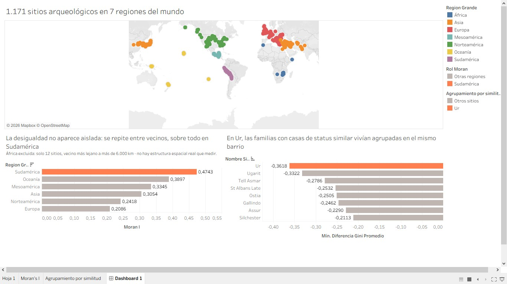

# ArqueoData — GINI Inequality (Kohler et al. 2025)

🇦🇷 [Leer en español](README.md)

An original re-analysis of a public archaeological dataset (>1,100
sites, >47,000 residential units, global scale) on economic inequality
measured as a Gini coefficient of house size. This is not a summary of
the paper: the angle — spatial contagion of inequality between
neighboring sites — is a gap the paper itself acknowledges it did not
explore.



**Interactive dashboard:** https://public.tableau.com/app/profile/gonzalo.enrique.garcia/viz/Tableau_kohler_2025/Dashboard1

## Research question

Does a site's Gini coefficient relate to that of its geographic
neighbors? The main paper measures inequality site by site and
explicitly acknowledges that it "does not take into account possible
connections with neighboring settlement hierarchies" — that is the gap
this project fills.

## Main finding

With a global Moran's I (k=5 nearest neighbors, great-circle distance,
999 permutations) stratified by region, inequality correlates
positively and significantly with that of geographic neighbors in the
6 regions with a reliable sample (n ≥ 20):

| Region | n | Moran's I | p-value |
|---|---|---|---|
| South America | 54 | 0.474 | 0.001 |
| Oceania | 24 | 0.390 | 0.002 |
| Mesoamerica | 155 | 0.335 | 0.001 |
| Asia | 265 | 0.305 | 0.001 |
| North America | 276 | 0.242 | 0.001 |
| Europe | 385 | 0.209 | 0.001 |

Africa is excluded from the analysis (n=12, nearest neighbor over
6,000 km away on average — there is no real spatial structure to
measure at that dispersion). South America shows both the strongest
effect and the closest neighbors to each other (median 5.9 km).

As a secondary line, the dashboard also shows within-site clustering by
similarity (neighborhoods of similar economic status tend to sit
together), using the `SiteGiniNeib` dataset from the same project.

## Tech stack

- **Python** (pandas, numpy, scikit-learn, libpysal, esda) — cleaning,
  table preparation, and Moran's I computation.
- **PostgreSQL** — `gini` schema in its own database (`kohler_gini`),
  independent from the rest of the ArqueoData projects.
- **Tableau Public** — final dashboard.

## About the data and its license

This repository **includes no CSV files at all**, neither the original
tDAR dataset nor the files the pipeline itself produces. Two reasons:

1. **Unresolved licensing.** The Kohler et al. paper (PNAS) is
   licensed CC BY-NC-ND 4.0, but that license is declared over *the
   article*, not the dataset — neither the paper nor the tDAR dataset
   page states an explicit reuse license for the data. Given that
   ambiguity, the decision was to not redistribute anything and point
   to the source instead.
2. Consistency with the rest of the ArqueoData portfolio, where raw
   data is likewise not versioned in the public repo.

**The original dataset is openly accessible** (just requires a free
tDAR account) and can be downloaded here, with attribution to the
original authors:

- **Dataset:** Ortman, S., Kohler, T.A., Bogaard, A. *SiteGiniLevel*
  (tDAR id: 502392). Full collection (9 datasets):
  https://core.tdar.org/collection/72000/gini-project-data-files
- **Main paper:** Kohler, T.A., Bogaard, A., Ortman, S.G. et al. 2025.
  "Economic inequality is fueled by population scale, land-limited
  production, and settlement hierarchies across the archaeological
  record." *PNAS* 122(16), e2400691122.
  https://doi.org/10.1073/pnas.2400691122
- **Special Feature introduction:** Kohler, T.A., Bogaard, A., Ortman,
  S.G. 2025. "Introducing the Special Feature on housing differences
  and inequality over the very long term." *PNAS* 122(16), e2401989122.

What this repository does include (`scripts/`, `sql/`) is the code for
the full pipeline, reproducible against the original data downloaded
from tDAR under your own account.

## Repository structure

```
scripts/
  01-06_eda_*.py                        EDA over the raw tDAR CSVs
  07_preparar_tablas_postgres.py        cleaning + load-ready tables
  08_construir_base_postgres.py         loads the schema and the data
  09_moran_i_por_bigregion.py           Moran's I stratified by region
  10_eda_homofilia_intra_sitio.py       EDA of within-site clustering
  11_exportar_tableau.py                exports the views for Tableau
sql/
  01_esquema_postgres.sql               DDL for the `gini` schema
Tableau_kohler_2025.twb                 Tableau workbook (reference only;
                                        data paths won't resolve without
                                        running the pipeline locally)
```

## How to run the pipeline

Requires the 9 original tDAR CSVs (not included, see above — free to
download with your own account) and a local PostgreSQL instance.

```bash
pip install -r requirements.txt

# 1-6. EDA (optional, exploration only)
python scripts/01_eda_site_gini_level.py
# ...

# 7. Prepare intermediate tables
python scripts/07_preparar_tablas_postgres.py

# 8. Create the database (once) and load schema + data
$env:PGPASSWORD="..."
createdb -U postgres -h localhost kohler_gini
python scripts/08_construir_base_postgres.py

# 9-10. Analysis (Moran's I, clustering by similarity)
python scripts/09_moran_i_por_bigregion.py
python scripts/10_eda_homofilia_intra_sitio.py

# 11. Export for Tableau
python scripts/11_exportar_tableau.py
```

## Declared limitations

- House size is a **floor**, not a ceiling, on real inequality — the
  paper itself notes this (it doesn't capture movable wealth, access
  to resources, etc.).
- Africa is excluded from any comparison due to an insufficient sample
  (n=12) and extreme geographic dispersion.
- The dataset groups Cyprus under `Bigregion = Asia` by archaeological
  convention (Near Eastern exchange sphere), not political geography —
  and carries an uncorrected internal inconsistency between two
  Cypriot sites (Khirokitia, Marki Alonia) labeled `Europe` under the
  same `Region` as the rest. Left uncorrected since we are not regional
  specialists qualified to decide which label is wrong.

## Author

Gonzalo García — [Tableau Public](https://public.tableau.com/app/profile/gonzalo.enrique.garcia)
